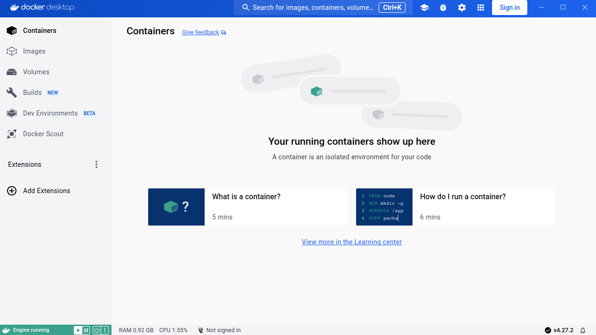

# Instalación de Docker Desktop en Linux

Podemos [instalar](https://docs.docker.com/desktop/install/linux-install/) **Docker Desktop** en distintas distribuciones Linux: Debian, Fedora, Ubuntu,... En este apartado vamos a realizar la instalación en la distribución [Ubuntu](https://docs.docker.com/desktop/install/ubuntu/).

Los requisitos mínimos necesarios son:

* CPU con arquitectura de 64 bits y soporte de virtualización.
* Virtualización KVM.
* Entorno gráfico Gnome, KDE o MATE.
* 4 Gb de RAM.
* A partir de Ubuntu 22.04.

1. Configuramos los repositorios de Docker:
    ```
    sudo apt-get update
    sudo apt-get install ca-certificates curl gnupg
    sudo install -m 0755 -d /etc/apt/keyrings
    curl -fsSL https://download.docker.com/linux/ubuntu/gpg | sudo gpg --dearmor -o /etc/apt/keyrings/docker.gpg
    sudo chmod a+r /etc/apt/keyrings/docker.gpg
    
    echo \
    "deb [arch="$(dpkg --print-architecture)" signed-by=/etc/apt/keyrings/docker.gpg] https://download.docker.com/linux/ubuntu \
    "$(. /etc/os-release && echo "$VERSION_CODENAME")" stable" | \
    sudo tee /etc/apt/sources.list.d/docker.list > /dev/null
    ```

2. Descargamos el paquete deb de la página oficial de instalación:

    

3. Instalamos Docker Desktop:

    ```
    sudo apt-get update
    sudo apt-get install ./docker-desktop-<version>-<arch>.deb
    ```

    La `<version>` y el `<arch>` dependerán de qué versión y arquitectura te hayas descargado.

4. Tendremos a nuestra disposición un icono que permite iniciar **Docker Desktop**. En este momento se iniciará la máquina virtual donde se está ejecutando el demonio Docker.

    

    También tenemos a nuestra disposición en la máquina donde hemos instalado **Docker Desktop** el cliente Docker:

    ```bash
    $ docker version
    Client: Docker Engine - Community
     Cloud integration: v1.0.35+desktop.10
     Version:           25.0.3
     ...
    Server: Docker Desktop 4.27.2 (137060)
     Engine:
      Version:          25.0.3
      ...

## Autentificación en Docker Hub desde Docker Desktop

**Docker Hub** es el registro público de imágenes Docker. De este registro vamos a descargar las imágenes que necesitemos. Si queremos subir al registro nuestras propias imágenes tendremos que [registrarnos en este servicio](https://hub.docker.com/signup).

Desde **Docker Desktop** podemos autentificarnos en **Docker Hub** con nuestra cuenta, de esta manera podremos gestionar nuestras imágenes en el registro.

En distribuciones Linux vamos a usas claves GPG para cifrar las credenciales de acceso, y estas credenciales se van almacenar usando la utilidad `pass`.

Lo primero que tenemos que hacer es inicializar un par de claves GPG (pública y privada), para ello:

```bash
$ gpg --generate-key
...
gpg: clave 09FFD80DB166C498 marcada como de confianza absoluta
gpg: creado el directorio '/home/usuario/.gnupg/openpgp-revocs.d'
gpg: certificado de revocación guardado como '/home/usuario/.gnupg/openpgp-revocs.d/B4901885C051839E8CBEA0E609FFD80DB166C498.rev'
claves pública y secreta creadas y firmadas.

pub   rsa3072 2024-02-15 [SC] [caduca: 2026-02-14]
      B4901885C051839E8CBEA0E609FFD80DB166C498
uid                      José Domingo Muñoz <josedom24@example.com>
sub   rsa3072 2024-02-15 [E] [caduca: 2026-02-14]

```

Durante la generación nos pedirá nuestro nombre y apellidos, nuestro correo electrónico y nos pedirá una "frase de paso" para asegurar el uso de la clave privada que estamos creando.

A continuación inicializaremos la utilidad `pass` usando la clave pública que hemos creado, tenemos que indicar el campo `ID` de la clave pública:

```bash
$ pass init B4901885C051839E8CBEA0E609FFD80DB166C498
mkdir: se ha creado el directorio '/home/usuario/.password-store/'
Password store initialized for B4901885C051839E8CBEA0E609FFD80DB166C498
```

En el directorio `/home/usuario/.password-store/` se guardarán las credenciales cifradas de acceso a Docker Hub.

Para finalizar, desde **Docker Desktop** podemos pulsar sobre el botón **Sign In** para loguearnos en **Docker Hub**. Y podremos comprobar que estamos autentificados de forma correcta:

