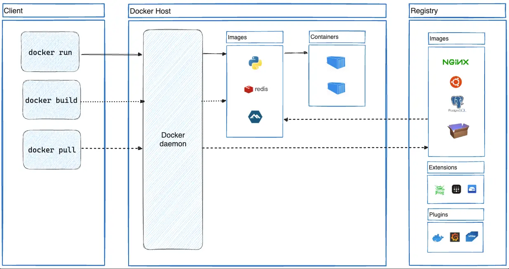

# Introducción a Docker

## Docker

* Docker es una tecnología de virtualización "ligera" cuyo elemento básico es la utilización de contenedores en vez de máquinas virtuales y cuyo objetivo principal es el despliegue de aplicaciones encapsuladas en dichos contenedores.
* Docker es una plataforma de código abierto diseñada para facilitar la creación, implementación y ejecución de aplicaciones en entornos contenerizados.

## Docker

* "Docker": estibador.
* Pertenece a los denominados contenedores de aplicaciones
* Nuevo paradigma. Cambia completamente la forma de desplegar y distribuir una aplicación basado en el lema **build, ship and run**.
* Lo desarrolla la empresa **Docker, Inc**, pero actualmente es un proyecto perteneciente a la **Cloud Native Computing Foundation (CNCF)** con lo que se asegura el desarrollo de los estándares  que se utilizan.
* Software libre.

## Objetos Docker

* **Contenedor**: 
    * Entorno aislado donde se ejecuta una aplicación. 
    * Tiene su propio sistema de ficheros con todas las dependencias que necesita la aplicación para funcionar. 
    * Puede estar conectado a una red virtual y utilizar almacenamiento adicional para no perder la información importante.
    * Utiliza los recursos del servidor donde se está ejecutando (núcleo del sistema operativo, CPU, RAM).    
    * Los contenedores Docker suelen ejecutar un sólo proceso.
    * Los contenedores Docker son efímeros
* **Imagen**: 
    * Una imagen es una plantilla de sólo lectura con instrucciones para crear un contenedor Docker. 
    * Contiene el sistema de fichero que tendrá el contenedor. 
    * Además establece el comando que ejecutará el contenedor por defecto. 
    * Podemos crear nuestras propias imágenes o utilizar las creadas por otros y publicadas en un registro. 
    * Un contenedor es una instancia ejecutable de una imagen. 
* **Redes, Volúmenes, Plugins**

## Arquitectura de Docker

Docker utiliza una arquitectura cliente-servidor. El **cliente Docker** se comunica (usando una API REST) con el **demonio Docker**, encargado de gestionar las imágenes, contenedores, volúmenes, redes,...

## Arquitectura de Docker

* **El demonio Docker (Docker Engine)**: Ofrece una API REST que utiliza el cliente Docker, y gestiona los objetos Docker.
    * El ordenador donde está instalado el demonio Docker lo llamaremos **Host Docker**.
    * De forma predeterminada el demonio Docker y los contenedores que gestionan se ejecutan por el usuario administrador del sistema.
    * Podemos instalador Docker para ser usado por usuario sin privilegios (**modo rootless**), aunque tiene algunas limitaciones se consigue tener más seguridad.
* **El cliente Docker**: Usando el comando `docker` nos comunicamos con el demonio Docker para gestionar los objetos Docker con los que trabajamos. El cliente y el demonio pueden estar en equipos distintos.
* **Registros Docker**: Un registro Docker almacena imágenes Docker. **Docker Hub** es un registro público que cualquiera puede utilizar, y Docker busca imágenes en Docker Hub de forma predeterminada. Podemos instalar en nuestros servidores  registros privados.
* **Docker Desktop**: Aplicación gráfica que permite la gestión sencilla de objetos Docker. Incluye el demonio y el cliente Docker.
* **Docker Swarm**: Es la solución de orquestación de contenedores ofrecida por Docker.

## Docker en la actualidad

Podemos obtener Docker de varias formas:
* **Moby**: Proyecto de comunidad (*docker.io* de debian/ubuntu). [Más información](https://mobyproject.org/)
* **Docker CE**: Componentes de Docker proporcionado por la empresa Docker inc.
    * Para uso personal es gratuito.
    * Para uso profesional, ofrecen distintos tipos de suscripciones con diferentes precios:
        * Pro, Team, Business
        * [Más información](https://www.docker.com/pricing/)

## Instalar Docker CE

Dos opciones:

* Instalar **Docker Engine**:
    * Incluye el cliente y el demonio Docker.
    * Sólo se puede instalar en distribuciones Linux: CentOS, Debian, Fedora, Ubuntu, ...
* Instalar **Docker Desktop**:
    * Incluye el cliente y el demonio Docker.
    * El demonio Docker se ejecuta en una máquina virtual.
    * Nos ofrece una aplicación gráfica para gestionar los objetos Docker.
    * Es necesario tener entorno gráfico.
    * Incluye algunas otras funcionalidades,...
    * Se puede instalar en Linux, Windows y Mac.

## Alternativas a Docker

Otras empresas han desarrollado software de contenedores de aplicación:

* **podman**: Creado por Red Hat como alternativa a docker. [Más información](https://podman.io).
* **containerd**: Inicialmente desarrollado por Docker, containerd es un componente fundamental en la arquitectura de Docker que ha sido separado como un proyecto independiente y es parte de la **Cloud Native Computing Foundation (CNCF)**. [Más información](https://containerd.io/).
* **CRI-O**: También desarrollado por Red Hat y parte de la CNCF, CRI-O se centra en proporcionar una implementación liviana y especializada para la ejecución de contenedores en entornos de Kubernetes. [Más información](https://cri-o.io/).
* **pouch**: Otro sistema de contenedores creado por la empresa Alibaba como alternativa a Docker. [Más información](https://pouchcontainer.io).

## Limitaciones de Docker

* Docker ha revolucionado el uso de los contenedores, para el despliegue de aplicaciones web.
* Pero Docker tiene algunas limitaciones:
    * El proceso de actualización de versiones en producción.
    * ¿Cómo se balancea la carga entre contenedores iguales?
    * ¿Cómo se conectan contenedores que se ejecutan en diferentes demonios de docker?
    * ¿Se puede hacer una actualización de una aplicación sin interrupción?
    * ¿Se puede variar a demanda el número de réplicas de un determinado contenedor?

* Las respuestas a estas preguntas y otras similares tiene que venir del uso de un **Orquestador de Contenedores**.

## Orquestadores de contenedores

* Un Orquestador de contenedores es un programa que gestiona los contenedores que se ejecutan en un clúster de servidores. Nos ofrece muchas características:
    * Actualizaciones automáticas, balanceo de carga, tolerancia a fallos, escalabilidad, . . .

* Distintas alternativas:
    * Docker swarm
    * Apache Mesos
    * Hashicorp Nomad
    * Kubernetes

* Hoy en día se acepta generalmente que el vencedor ha sido kubernetes. ¿Por qué?:
    * Gran cantidad de empresas implicadas en su desarrollo, iniciada por Google pero donada a la CNCF con una versión inicial muy madura, gran número de aplicaciones complementarias,. . . 
    * El resto de proyectos siguen activos, como alternativas más sencillas a k8s o en su propio nicho.

