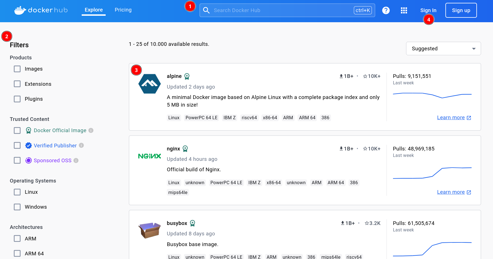
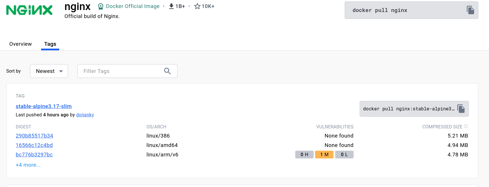

# Registro de imágenes: Docker Hub

## Docker Hub

[**Docker Hub**](https://hub.docker.com/) es un registro público de imágenes Docker.

## Conceptos de Docker Hub

* **Repositorio**: Un repositorio nos permite guardar una imagen. De cada imágenes podemos tener distintas versiones indicada con su etiqueta.
* **Usuarios**: Nos podemos dar de alta en **Docker Hub** para subir y distribuir nuestras imágenes.
* El nombre de una imagen: **usuario/nombre:etiqueta**.
* Las imágenes oficiales en Docker Hub no tienen nombre de usuario.

## Tipos de imágenes

Podemos encontrar con varios tipos de imágenes,s egún lo que nos ofrece:

* Imágenes que nos ofrecen una **distribución completa de un sistema operativo** (Ubuntu, CentOs, Debian, Fedora....). La distribución **alpine** se empaquetan en imaǵenes pequeños, que sólo incluyen los elementos esenciales necesarios para ejecutar una aplicación. Además nos podemos encontrar imágenes de este tipo con la etiqueta **slim**, en este caso serán imágenes más livianas.
    * Ejemplo: **debian:bookworm**, **debian:bookworm-slim**, **ubuntu:22.04**, **alpine:3**.
* Imágenes que nos ofrecen distintos **servidores** (servidor web, servidor de base de datos,...). En este caso las etiquetas suelen indicar la versión y el sistema operativo base que ofrece el servicio.
    * Ejemplo: **http:2.4-bookworm**, **http:2.4-alpine**, **mariadb:11.2-jammy**, **mariadb:10.6-focal**.
* Imágenes que ofrecen **lenguajes de programación** (php, python, java, nodejs,...). En este caso la etiqueta nos puede indicar la versión, el sistema operativo base que se utiliza, el servicio que se está ofreciendo.
    * Ejemplo: **php:bookworm**, **php:fpm-bookworm**, **python:3.12-slim-bookworm**, **openjdk:23-ea-6-jdk-bookworm**.
* Imágenes que ofrecen un CMS completo (WordPress, NextCloud, Drupal,...). Como en el caso anterior, las etiquetas nos informan de la versión, del sistema operativo, del servicio ofrecido,...
    * Ejemplos: **wordpress:6.4.2-php8.1-apache**, **wordpress:6.4.2-php8.1-fpm**, **wordpress:6.4.2-fpm-alpine**.

## Contenido de confianza

* **Imágenes oficiales Docker**: Son mantenidas y distribuidas directamente por Docker, Inc. Son confiables, bien mantenidas y son una opción segura para utilizar en entornos de producción.

* **Editor verificado Docker**: Las imágenes que tienen este logotipo, son proporcionadas por editores verificados por Docker. Estas imágenes se caracterizan por su actualización continúa para evitar problemas de seguridad.

* **Imágenes de código abierto patrocinadas por Docker**: Estás imágenes son publicadas y mantenidas por proyectos de código abierto patrocinados por Docker.

## Introducción a la interfaz web de Docker Hub

Podemos acceder al registro público de imágenes Docker **Docker Hub** en el enlace: [https://hub.docker.com](https://hub.docker.com).

Podemos observar varios elementos:

1. Un formulario de búsqueda que nos permite buscar imágenes por palabras.
2. Si tenemos muchos resultados tenemos la opción de filtrar la búsqueda por tipo de producto, contenido de confianza, sistema operativo y arquitectura.
3. Al hacer la búsqueda obtenemos una lista de **repositorios**. Cada repositorio puede almacenar distintas versiones de una misma imagen.
4. Podemos darnos de alta en docker Hub, para gestionar nuestras propias imágenes. 

Si accedemos a un repositorio, visualizaremos la documentación de la imagen (pestaña **Overview**). Iremos estudiando detenidamente la documentación de varias imágenes, pero los apartados más comunes que nos encontramos son los siguientes:

* Descripción de la aplicación o servicio ofrecida por la imagen.
* Etiquetas con las que podemos trabajar en esta imagen.
* Ejemplos de cómo crear contenedores a partir de esta imagen.
* Variables de entorno que puedo crear en la creación para configurar el servicio o la aplicación.
* Directorios que debo almacenar para hacer el contenedor persistente.
* Ejemplos de ficheros `docker-compose.yaml` para suar Docker Compose para gestiona el ciclo de vida de la aplicación.

En la pestaña **Tags** obtenemos una lista de todas las versiones de la imagen para cada uno de los sistemas operativos y arquitecturas.

