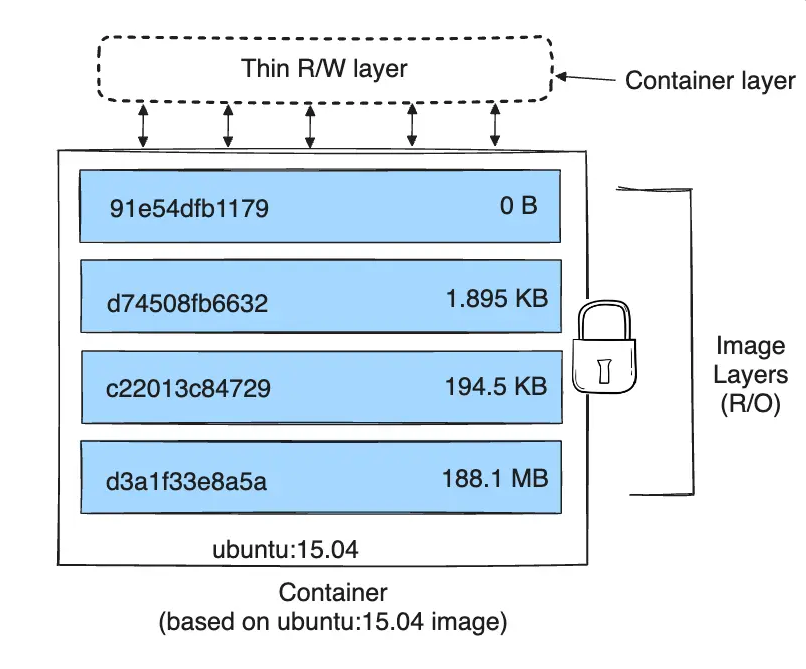
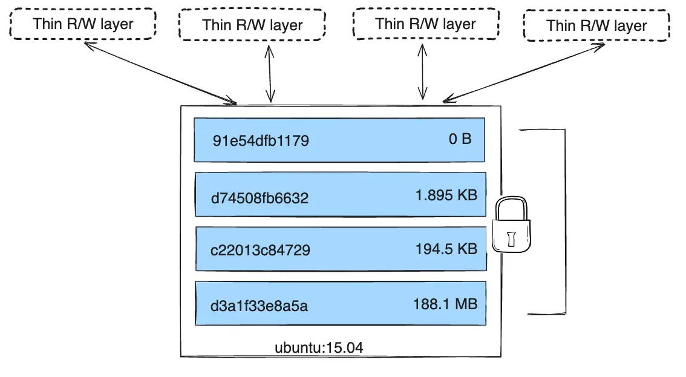

# ¿Cómo se organizan las imágenes?

Las imágenes se construyen a partir de **capas ordenadas**. 

## ¿Qué es una capa?

* Puedes pensar en una capa como un conjunto de cambios en el sistema de archivos. 
* En el proceso de creación de las imágenes, los comandos cambian el sistema de fichero (instalaciones, modificación de ficheros, copiar ficheros,...) producen una nueva capa.
* Cada capa es sólo un conjunto de diferencias con respecto a la capa anterior.
* Cada capa se guarda en un directorio diferente.
* Cuando tomas todas las capas y las apilas, obtienes una nueva imagen que contiene todos los cambios acumulados.
* Si tienes muchas imágenes basadas en capas similares, como Sistema Operativo base o paquetes comunes, entonces todas éstas capas comunes serán almacenadas solo una vez.

## ¿Qué ocurre cuando creamos un contenedor?

* Cuando se crea un nuevo contenedor desde una imagen, su sistema de archivo será la unión de todas las capas de la imagen. 
* Las capas de la imagen son únicamente de lectura, por lo que se añade una nueva capa de lectura-escritura. 
* Todos los cambios efectuados al contenedor específico son almacenados en esa capa.
* Esta capa se suele llamar **Capa del Contenedor**.
* Los contenedores son efímeros, por que cuando lo borramos se borra la capa del contenedor, por lo que se pierde todos sus datos.
* Por lo tanto cuando creamos un contenedor, el almacenamiento en disco es muy pequeño, ya que que las capas de la imagen desde la que se ha creado se comparten con el contenedor y la capa del contenedor en un primer momento tiene muy pocos ficheros.

