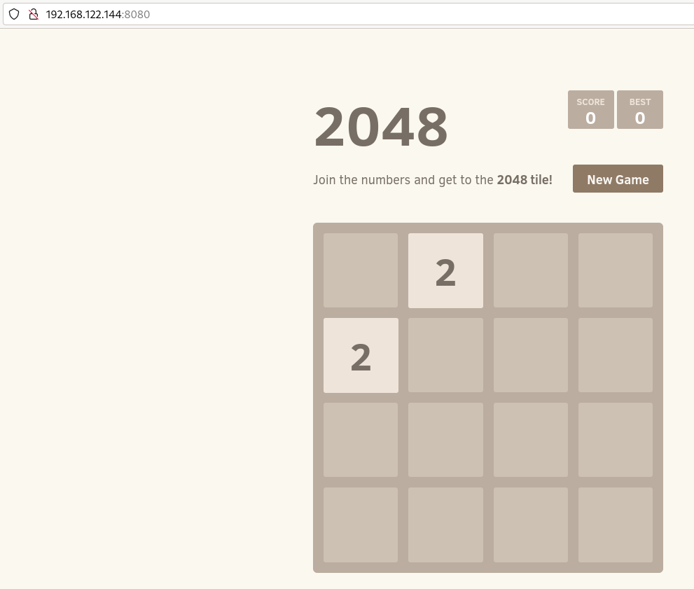
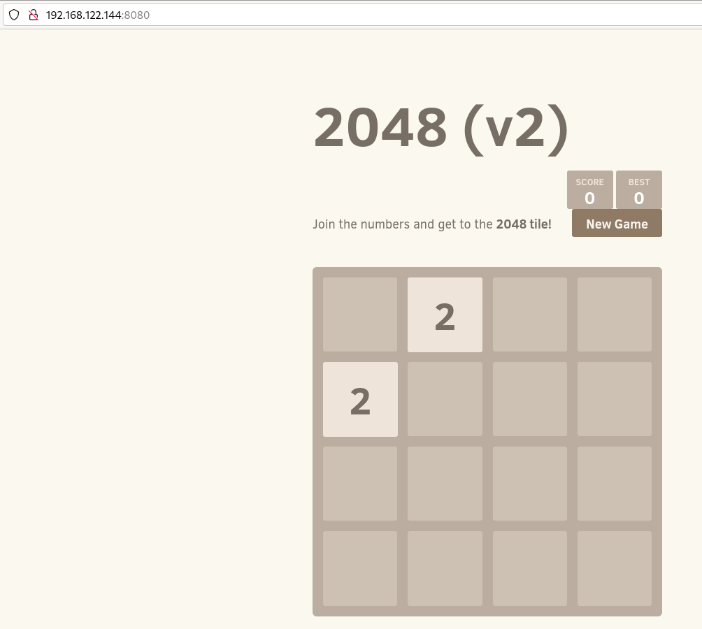

# Ciclo de vida de nuestras aplicaciones con Docker

**El ciclo de vida de una aplicación Docker** tendría los siguientes pasos:

* Paso 1: Desarrollo de nuestra aplicación.
* Paso 2: Creación de la imagen Docker.
* Paso 3: Probamos nuestra aplicación en el entorno de desarrollo o prueba.
* Paso 4: Distribuimos nuestra imagen.
* Paso 5: Implantación de la aplicación en el entorno de producción.
* Paso 6: Modificación de la aplicación, volviendo al paso 2.

Puedes encontrar los ficheros necesarios para realizar este ejemplo en el [Repositorio con el código de los ejemplos](https://github.com/josedom24/ejemplos_curso_docker_ow).

## Paso 1:Desarrollo de nuestra aplicación

Vamos a imaginar que nuestro "equipo de desarrollo" ha creado una aplicación web. En este caso tenemos nuestra aplicación web escrita en JavaScript llamada 2048 guardada en un repositorio GitHub. La aplicación 2048 es un juego de habilidad matemática inspirado en el juego 1024 cuyo código original puedes encontrar en este [repositorio GitHub](https://github.com/gabrielecirulli/2048). 

Para realizar este ejercicio he hecho un fork del repositorio en mi cuenta de GitHub, de esta manera podré hacer modificaciones del mismo.

## Paso 2: Creación de la imagen Docker

Vamos a crear una imagen Docker a partir de un fichero `Dockerfile`:

```Dockerfile
# syntax=docker/dockerfile:1
FROM nginx
WORKDIR /usr/share/nginx/html/
ADD https://github.com/josedom24/2048.git .
EXPOSE 80
```

En esta ocasión no hemos usado la instrucción `COPY` para copiar ficheros a la imagen, hemos usado `ADD` que funciona como `COPY` pero que además nos permite copiar ficheros remotos, en este caso hemos copiado los ficheros del repositorio que hemos forkeado.

Creamos nuestra imagen, desde el directorio donde tenemos el `Dockerfile`, ejecutamos:

```bash
$ docker build -t josedom24/2048:v1 .
```
Podemos comprobar que en nuestro entorno local tenemos la imagen que acabamos de crear:

```bash
$ docker images
REPOSITORY          TAG       IMAGE ID       CREATED             SIZE
josedom24/2048      v1        ea9228809799   8 minutes ago       187MB
...
```

## Paso 3: Probamos nuestra aplicación en el entorno de desarrollo

Creamos un contenedor en nuestro entorno de desarrollo:

```bash
$ docker run --name ap2048 -d -p 8080:80 josedom24/2048:v1
  
$ docker ps
CONTAINER ID   IMAGE               COMMAND                  CREATED         STATUS        PORTS                                   NAMES
762397879d5e   josedom24/2048:v1   "/docker-entrypoint.…"   4 seconds ago   Up 1 second   0.0.0.0:8080->80/tcp, :::8080->80/tcp   ap2048
```

Probamos nuestra aplicación:



## Paso 4: Distribuimos nuestra imagen

Vamos a subir nuestra imagen al registro Docker Hub:

```bash
$ docker login
...
$ docker push josedom24/2048:v1
...
```

Comprobamos que está subida al repositorio:

```bash
$ docker search josedom24/2048
NAME             DESCRIPTION   STARS     OFFICIAL
josedom24/2048                 0         
```

## Paso 5: Implantación de la aplicación

En el entorno de producción, bajamos la imagen de Docker Hub y creamos el contenedor:

```bash
$ docker pull josedom24/2048:v1
...
$ docker run --name ap2048_prod -d -p 80:80 josedom24/2048:v1
```

## Paso 6: Modificación de la aplicación

Al modificar el código de la aplicación tenemos que generar una nueva imagen. Podemos cambiar en fichero `index.html` de la aplicación y modificar la siguiente línea indicando la versión:

```html
<h1 class="title">2048 (v2)</h1>
```

Guardamos los cambios en el repositorio y generamos una nueva versión de la imagen:

```bash
$ docker build -t josedom24/2048:v2 .
```

Podemos probarla en el entorno de desarrollo, eliminando el contenedor anterior:

```bash
$ docker rm -f ap2048
$ docker run --name ap2048 -d -p 8080:80 josedom24/2048:v2
```

Y probamos la aplicación:



Subimos la nueva versión de la aplicación a Docker Hub y la bajamos en el entorno de producción. Eliminamos el contenedor de la versión antigua y creamos un nuevo contenedor con la nueva imagen:

En desarrollo:

```bash
$ docker push josedom24/2048:v2
...
```

En producción:

```bash
$ docker pull josedom24/2048:v2
...
$ docker rm -f ap2048_prod
$ docker run --name ap2048_prod -d -p 80:80 josedom24/2048:v2
```