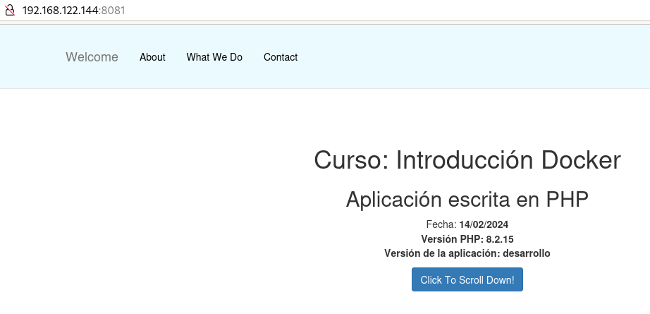
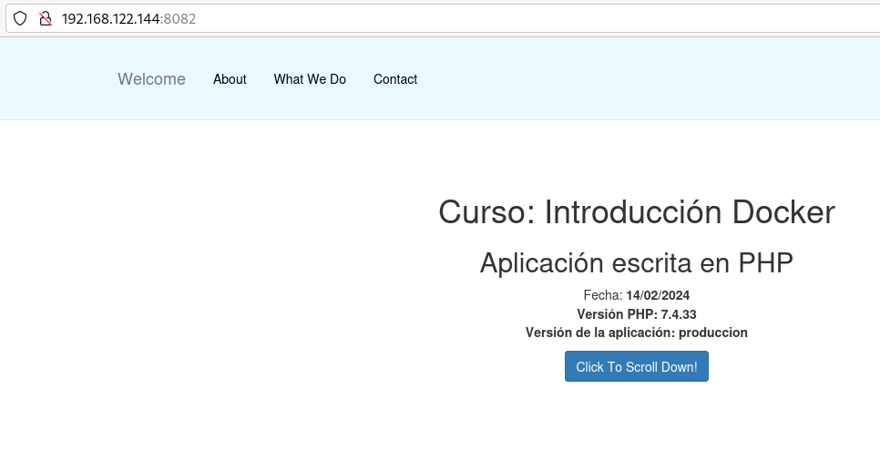

# Uso de ficheros Dockerfile parametrizados

El uso de parámetros en la creación de ficheros `Dockerfile` es una buena forma de añadir flexibilidad a tus construcciones de imágenes Docker. El valor de estos parámetros se pueden pasar a la hora de construir la imagen con el comando `docker build` o indicados valores predeterminados si no se especifican en el momento de la construcción.

Puedes encontrar los ficheros necesarios en el [Repositorio con el código de los ejemplos](https://github.com/josedom24/ejemplos_curso_docker_ow).

Veamos un ejemplo:

```Dockerfile
# syntax=docker/dockerfile:1
ARG PHP_VERSION=8.2-apache
FROM php:${PHP_VERSION}
ARG APP_VERSION=desarrollo
ENV VERSION=${APP_VERSION}
COPY app /var/www/html/
EXPOSE 80
```

Para crear los parámetros usamos la instrucción `ARG` en el fichero `Dockerfile`. Hemos creado dos parámetros en la definición del fichero `Dockerfile`:

* `PHP_VERSION`: Donde vamos a indicar la etiqueta de la imagen PHP que vamos a usar en la construcción. Su valor por defecto es `8.2-apache` y como vemos, para hacer referencia a ella usamos `${PHP_VERSION}`.
* `APP_VERSION`: Es un parámetro donde vamos a guardar la versión de la aplicación (`desarrollo`) y que posteriormente utilizaremos para darle valor a la variable de entorno `VERSION`.

Si construimos la imagen sin sobrescribir los valores de los parámetros se tomarán los valores por defecto:

```bash
$ docker build  -t josedom24/app_php:v1 .
$ docker run -d -p 8081:80 --name app1 josedom24/app_php:v1
$ docker exec -it app1 env
...
VERSION=desarrollo
...
```

Como vemos se ha creado una imagen a partir de la imagen `php:8.2-apache` y se ha creado una variable de entorno `VERSION` con el valor por defecto. Si accedemos a la página con un navegador web, veremos la versión de PHP y el valor de la variable de entorno que hemos creado (también podríamos acceder al fichero `info.php` para ver esta información):



Podemos crear otra versión de la imagen sobreescribiendo los parámetros de construcción, para ello usamos el parámetro `--build-arg` en el comando `docker build`:

```bash
$ docker build --build-arg PHP_VERSION=7.4-apache --build-arg APP_VERSION=produccion -t josedom24/app_php:v2 .
$ docker run -d -p 8082:80 --name app2 josedom24/app_php:v2
$ docker exec -it app2 env
...
VERSION=produccion
...
```

Accedemos a esta nueva aplicación y vemos los parámetros que hemos configurado:



