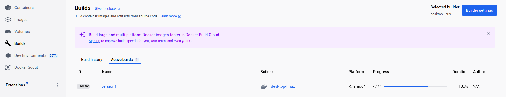
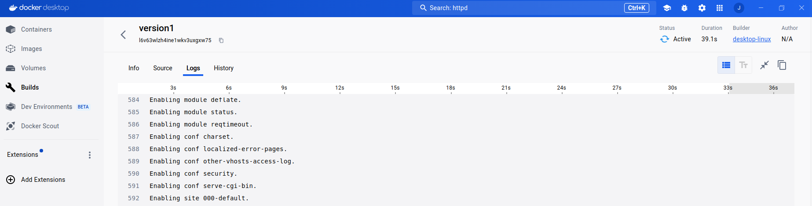
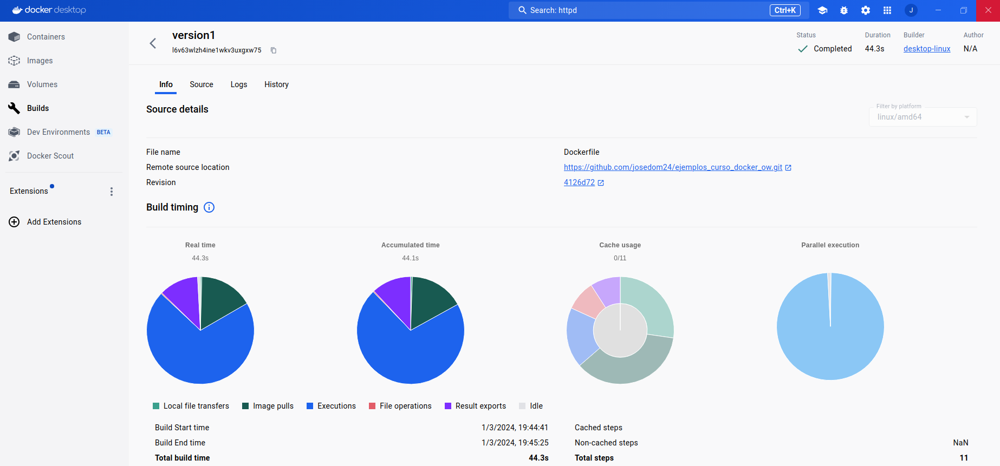

# Gestión de creación de imágenes en Docker Desktop

## La vista de construcción de imágenes

La vista de construcción de imágenes es una interfaz sencilla que le permite inspeccionar su historial de construcciones y gestionar las construcciones utilizando Docker Desktop.

Podemos ver el historial de construcciones realizadas y la construcción activa que se está realizando en este momento.

Si accedemos al detalle de la construcción activa, sólo podremos acceder a los logs de la construcción:

## Inspeccionar construcción

Si accedemos a la información a una construcción ya finalizada podemos obtener la siguiente información:

* **Info**: Nos muestra información de la construcción:
    * **Source details**:  Nos muestra información sobre el fichero `Dockerfile` por ejemplo el repositorio donde se encuentra.
    * **Build timing**: La sección Tiempo de compilación contiene gráficos que muestran información de la construcción:
        * El tiempo real se refiere al tiempo total de construcción.
        * El tiempo acumulado muestra el tiempo total de uso de CPU para realizar la construcción.
        * El uso de caché muestra información sobre el almacenamiento en caché de la construcción.
        * La ejecución paralela muestra cuánto tiempo de ejecución de la compilación se dedicó a ejecutar pasos en paralelo.
    * **Dependencies**: La sección Dependencias muestra imágenes y recursos remotos utilizados durante la construcción:
        * Imágenes de contenedores utilizadas durante la construcción.
        * Repositorios Git incluidos mediante la instrucción `ADD` en el fichero `Dockerfile`.
        * Recursos HTTPS remotos incluidos mediante la instrucción `ADD` en el fichero `Dockerfile`.
    * **Configuration**: Nos muestra los parámetros pasados a la construcción:
        * Argumentos de construcción.
        * Etiquetas.
        * ...
    * **Build results**: Nos muestra un resumen de los artefactos de compilación generados.
* **Source**: Nos muestra el fichero `Dockerfile` usado para la construcción. Si hay un error en la construcción nos señalará el error en esta pestaña.
* **Logs**: Nos muestra la salida de la ejecución de los distintos pasos que se ejecutan en la construcción y están indicados en el fichero `Dockerfile`.
* **History**: La pestaña Historial muestra datos estadísticos sobre las construcciones completadas. El gráfico ilustra las tendencias en la duración, los pasos de compilación y el uso de la caché para las distintas construcciones.

