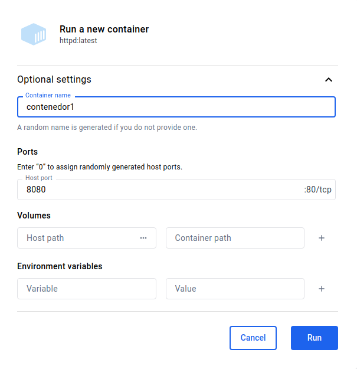
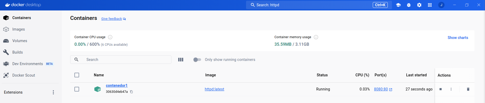
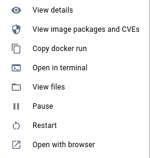
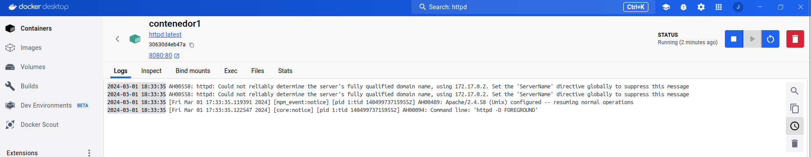
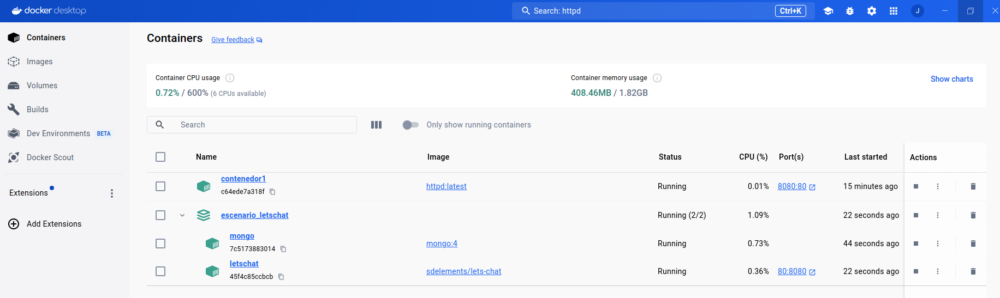

# Gestión de contenedores en Docker Desktop

## Ejecución de contenedores

Partiendo de una imagen que tengamos en el registro local podemos ejecutar un nuevo contenedor con la opción **Run**. Podemos crear contenedores desatendidos (opción `-d` en `docker run`) y los datos que podemos configurar son los siguientes:

* El nombre del contenedor.
* El mapeo de puertos.
* El almacenamiento, volúmenes docker o bind mount.
* Las variables de entorno.

## Listado de contenedores

Al entrar en la vista de contenedores, vemos los contenedores que tenemos creados, con la siguiente información:

* Los recursos que están utilizando nuestros contenedores (CPU y memoria RAM).
* El nombre e identificados de los contenedores.
* La imagen desde la que se ha creado.
* El estado (En ejecución, parado, ...).
* El porcentaje de CPU que está utilizando.
* El mapeo de puertos. si pulsamos sobre esta información se abrirá el navegador y nos permitirá acceder a la aplicación que sirve el contenedor.
* El tiempo desde que se creó.

Las tareas que podemos ejecutar con los contenedores son **iniciar/parar** el contenedor, **eliminar** el contenedor y las siguientes que encontramos en el menú de acciones:

* **View details**: Nos da información del contenedor. Lo veremos en el siguiente apartado.
* **View packages and CVEs**: Nos lleva a la información de la imagen, donde entre otras cosas podremos ver los ficheros y las vulnerabilidades de la imagen.
* **Copy docker run**: Nos permite copiar en el portapapeles la instrucción `docker run` que crea el contenedor.
* **Open in terminal**: Nos permite acceder interactívamente al contenedor.
* **View files**: Nos permite ver los ficheros que hay en el sistema de archivos del contenedor.
* **Pause**: Nos permite pausar el contenedor.
* **Restart**: Nos permite reiniciar el contenedor.
* **Open with browser**: Nos permite acceder a la aplicación en un navegador web.

## Inspeccionar un contenedor

Si pulsamos sobre el nombre de un contenedor, nos aparece una pantalla donde podemos ver distintas informaciones del contenedor:

* **Logs**: Obtenemos los logs del contenedor.
* **Inspect**: Obtenemos información detallada del contenedor. Podemos selección determinada información que nos interesa.
* **Bind mounts**: Obtenemos los directorios que tenemos montados en el contenedor.
* **Exec**: Nos permite acceder interactívamente al contenedor.
* **Files**: Obtenemos las lista de ficheros que tiene el contenedor y nos indica cual ha sido modificado.
* **Stats**: Nos mustra distintas gráficas de uso de recursos (CPU, memoria RAM, lectura/escritura de disco, E/S de red,...).

## Docker Compose en Docker Desktop

Cuando levantamos un escenario con Docker Compose, podemos visualizar el escenario que hemos levantado y los contenedores que se han creado. Los escenarios, podemos iniciarlos o pararlos, y eliminarlos. Además podemos ver el detalle del escenario, donde se nos mostrará la lista de contenedores y los logs de los mismos.

