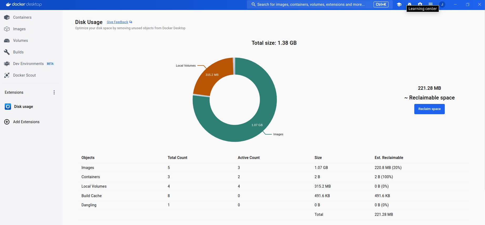
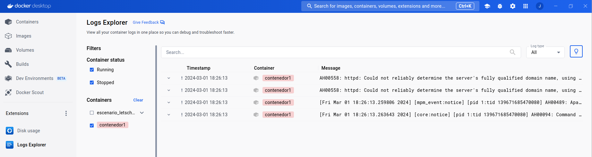
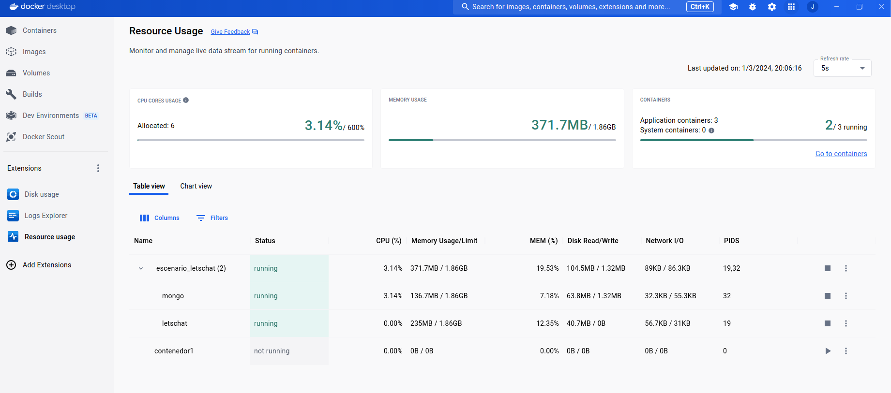
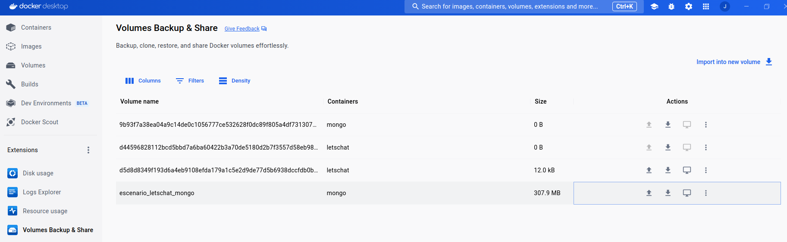

# Extensiones en Docker Desktop

Las extensiones nos permiten añadir nuevas funcionalidades a Docker Desktop. Al acceder a la vista de extensiones podemos [buscar en un repositorio](https://hub.docker.com/search?q=&type=extension) las distintas extensiones que distintas empresas han desarrollado y la podemos instalar. Veamos algunos ejemplos de extensiones:

## Disk usage

Esta extensión nos permite optimizar el almacenamiento, ya que además de mostrar de forma gráfica el almacenamiento que estamos utilizando con los objetos Docker, podemos eliminar los objetos que no estemos utilizando.

## Logs Explorer

Esta extensión nos permite centralizar la visualización de los logs de los contenedores. Además nos posibilita filtrar y realizar búsquedas en los logs.

## Resource usage

Esta extensión nos permite monitorizar en vivo los recursos usados por los contenedores (CPU, memoria RAM, red y disco,...).

## Volumes Backup & Share

Esta extensión nos permite varias tareas:

* Exportar un volumen: a un archivo comprimido, a una imagen, ...
* Importar datos a un nuevo volumen.
* Transferir un volumen a través de SSH a otro host que ejecute Docker Desktop o Docker engine.
* Clonar, vaciar o eliminar un volumen

