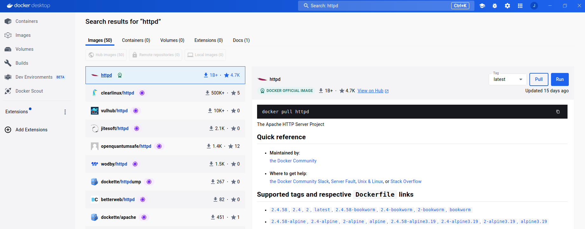
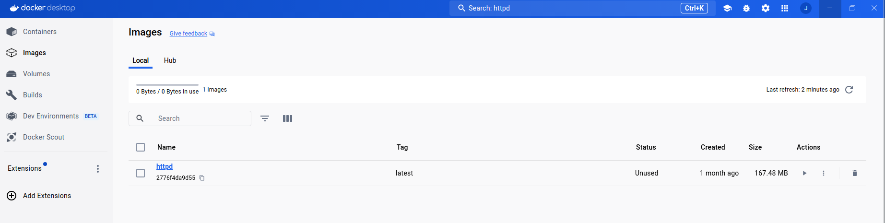
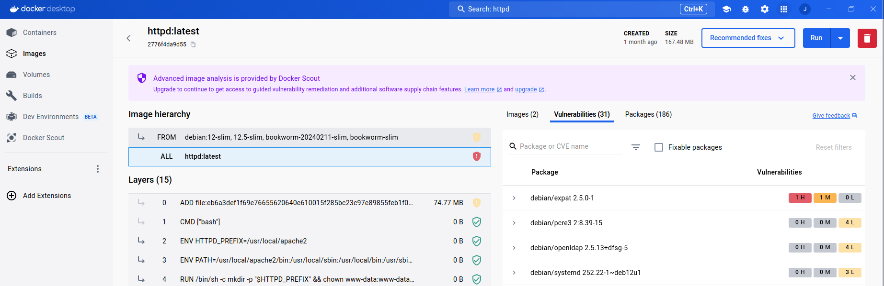

# Gestión de imágenes en Docker Desktop

## Descargas de imágenes

Docker Desktop nos permite buscar cualquier imagen de Docker Hub. Una vez elegida la imagen podemos ver distinta información de ella:

* Su identificador.
* Las etiquetas.
* La fecha de creación.
* El tamaño de la imagen.
* La documentación.

Las tareas que podemos realizar sobre la imagen que hemos buscado serán:

* **Pull**: Nos permite bajar la imagen a nuestro registro local.
* **Run**: Nos permite crear un contenedor a partir de esta imagen.

## Listado de imágenes

Al acceder a la vista de imágenes, podemos ver un listado de imágenes:

* En la pestaña **Local** vemos las imágenes descargadas en nuestro registro local. Podemos acceder a distinta informaciones:
    * El nombre y el identificador.
    * La etiqueta de la imagen.
    * El estado: si está en uso o no.
    * El tiempo de creación.
    * El tamaño.

    Además podemos ver las acciones que podemos realizar sobre la imagen:

    * **Run**: Nos permite la ejecución de un contenedor.
    * **View packages and CVEs**: Nos lleva a la información de la imagen, donde entre otras cosas podremos ver los ficheros y las vulnerabilidades de la imagen.
    * **Pull**: Nos permite bajar la imagen a nuestro registro local si ha sido modificada.
    * **Push to Hub**: Nos permite subir la imagen a Docker Hub.
    * **Delete**: Nos permite borrar la imagen del registro local.
* En la pestaña **Hub**, si estamos logueados podemos visualizar nuestras imágenes subidas a Docker Hub y realizar las siguientes tareas:
    * **View en Hub**: Te lleva a la página web de la imagen seleccionada en Docker Hub.
    * **Pull**: Nos permite bajar la imagen a nuestro registro local.

## Inspeccionar una imagen

Si pulsamos sobre el nombre de una imagen, nos aparece una pantalla donde podemos ver distintas informaciones de la imagen:

* **Image hierarchy**: Los comandos que se han ejecutado para crear la imagen. Similar al comando `docker history`.
* **Vulnerabilidades**: Lista de vulnerabilidades encontradas en los distintos paquetes instalados en la imagen.
* **Paquetes**: Lista de paquetes que tiene instalada la imagen.

