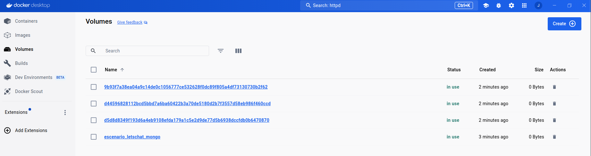
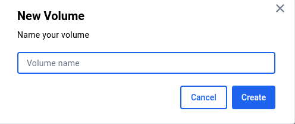

# Gestión de volúmenes en Docker Desktop

## Listado de volúmenes

En la vista de volúmenes podemos acceder a la lista de volúmenes disponible. Además del nombre del volumen, tenemos información del estado (si está en uso o disponible), el tiempo desde su creación y su tamaño. Además podemos eliminar un volumen que no este en uso.

Si pulsamos sobre el nombre de un volumen accederemos a una pantalla donde podremos visualizar los ficheros que hay almacenados en el volumen y el contenedor que lo está usando.

## Creación de volúmenes

Tenemos la opción de crear nuevos volúmenes indicando si nombre:

